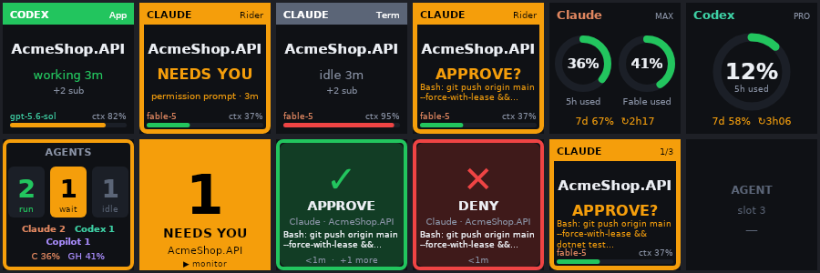
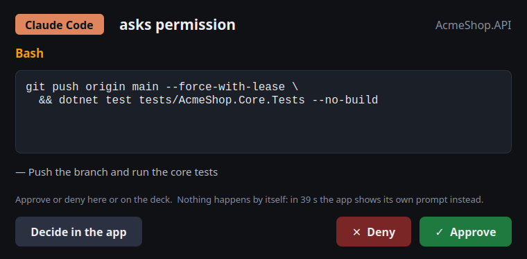

# AI Agent Monitor — OpenDeck plugin

Shows what your AI coding agents are doing on a stream deck (built for the Ulanzi D200X under
[OpenDeck](https://github.com/nekename/OpenDeck), works on any OpenDeck device):

- **Agent keys** — one running session per key, attention-first: Claude Code and Codex, whether they
  run in Rider, a terminal or the Codex desktop app. Green = working, amber = *needs you* (permission
  prompt, question, dialog), grey = idle. Shows project, host, elapsed time, model and context-window use.
  **Press → the agent's window comes to the front.**
- **Usage keys** — Claude (5 h / 7 d windows, Max/Pro) and Codex (weekly / 5 h) subscription usage with
  time-to-reset. Press → opens the usage page.
- **Overview** — counts of working / waiting / idle agents, per provider. Press → jump to the agent that needs you.
- **Attention → Monitor** — a small key for your *main* layout: lights up amber with the number of
  agents waiting for you; press → switches the deck to the dedicated monitoring profile (and back).
- **Select dial + Selected agent** — turn a knob to browse agents, press it to focus the selected one.
- **Approve / Deny** — when Claude Code (or Codex) asks for permission, the request is held for the deck: the agent
  key turns amber with **APPROVE?** and the tool call (e.g. `Bash: git push origin main`), the selection jumps to it,
  and the Approve/Deny keys (also the two side buttons) answer it. Pressing the agent key, the dial or the Selected
  agent key instead hands the request back to the terminal (its normal dialog appears) and focuses the window.
  Because the app's own prompt is not rendered while the hook holds the request, the full request is also shown
  on screen: a **Qt dialog** (`hooks/approval-dialog.py`, needs `python3` with PyQt6, PySide6 or PyQt5) with the
  command in a monospace box, a hold countdown and Approve / Deny / *Decide in the app* buttons — opened on the
  monitor of your choice (middle / primary / mouse), kept on top, and never taking keyboard focus, so an Enter you
  were typing cannot approve anything. Without a Qt binding it falls back to kdialog/zenity, and without those to
  a desktop notification with Approve / Deny buttons. The keys show the wrapped text too. No answer within the hold
  time → nothing is approved; the app shows its own prompt as usual.

**Scope**: Linux only. Tested with OpenDeck 2.14 on KDE Plasma 6 / X11 with an Ulanzi D200X (through the
[opendeck-ulanzi-d200x](https://github.com/edubox/opendeck-ulanzi-d200x) device plugin). Window focusing uses
`wmctrl`/`xdotool` with a KWin fallback, so it needs X11 (Wayland sessions get everything except focusing); the
profile generator targets the D200X layout — on other decks place the actions by hand. It relies on undocumented
internals of Claude Code (session registry, transcripts, usage endpoint) and Codex (rollouts, lock files, usage
endpoint), so a release of either tool can break a collector; the diagnostics below exist for exactly that.

Everything is read locally; nothing is sent anywhere except the two usage requests that Claude Code
and Codex already make themselves (`api.anthropic.com/api/oauth/usage`, `chatgpt.com/backend-api/wham/usage`),
using the tokens they store. Monitoring needs no hooks; approving from the deck needs one `PermissionRequest`
hook per tool (installed by `--install-hooks`, see below).





## How it knows

| Signal | Source |
|---|---|
| Claude session list + state (`busy` / `idle` / `waiting` + `waitingFor`) | `~/.claude/sessions/<pid>.json` (written by Claude Code itself; pid liveness verified via `/proc`) |
| Claude model, context tokens, session title | tail of `~/.claude/projects/<cwd>/<session>.jsonl` |
| Claude usage windows | `GET https://api.anthropic.com/api/oauth/usage` with the OAuth token in `~/.claude/.credentials.json` |
| Codex threads, turn state, model, context, sub-agents | `~/.codex/sessions/YYYY/MM/DD/rollout-*.jsonl` (`task_started` / `task_complete` / `token_count` …) |
| Codex thread liveness + owning process | the `flock` Codex holds on `~/.codex/thread-writer-locks/<thread>.lock` while a thread is loaded (found through `/proc/<pid>/fd`); no lock → closed/unloaded. Threads whose only turns are `external-import-*` (the desktop app mirroring Claude transcripts) are ignored |
| Codex usage | `rate_limits` in the rollouts, refreshed from `chatgpt.com/backend-api/wham/usage` with `~/.codex/auth.json` |
| "Inside Rider" vs terminal vs app | process ancestry of the agent process (`/proc`) |
| Window focus | `wmctrl -lp` (window ↔ pid ↔ ancestry, prefers a detached "Terminal - Project" window, then the project window) → switch to its virtual desktop, `xdotool windowmap` (un-minimize), `wmctrl -ia` + `xdotool windowactivate/windowraise`, verified with `xdotool getactivewindow`; fallback: a one-shot KWin script over D-Bus (`workspace.activeWindow`); a Codex app window hidden to the tray is brought back by relaunching `chatgpt` |
| Profile switching | `opendeck --process-message '{"event":"switchProfile",…}'` (plugins may not send it over the socket) |
| Permission requests | Claude `PermissionRequest` hook of type `http` → `POST http://127.0.0.1:43117/hooks/claude`; Codex `PermissionRequest` command hook (`hooks/codex-hook.sh`, curl) → `/hooks/codex`. The plugin holds the request open until a deck press (default 30 s) and answers `{"hookSpecificOutput":{"hookEventName":"PermissionRequest","decision":{"behavior":"allow"|"deny"}}}`; no press, timeout, or plugin not running → the normal dialog |

## Build & install

**From a release**: download `com.josbol.aiagentmonitor.sdPlugin-<version>.zip` from the GitHub releases page and
use OpenDeck → Plugins → *Install from file* (contains self-contained x64 and arm64 binaries; no .NET needed). Then
run the two scripts below for the profile and the hooks (they are also in the zip).

**From source**: .NET 10 SDK, `wmctrl` + `xdotool` (window focusing), `python3` + PyQt6/PySide6/PyQt5 (approval popup; falls back to `kdialog`/`zenity`, then `notify-send`),
OpenDeck ≥ 2.x with **developer mode** on if you install as a symlink.

```sh
./scripts/build.sh              # dotnet publish → plugin/com.josbol.aiagentmonitor.sdPlugin/bin/linux-x64 (RIDS="linux-x64 linux-arm64" for both)
./scripts/package.sh            # both architectures → dist/com.josbol.aiagentmonitor.sdPlugin-<version>.zip
./scripts/install.sh --link     # symlink into ~/.config/opendeck/plugins (or plain ./scripts/install.sh to copy)
./scripts/install-profile.py    # creates the "AI Agents" profile for the Ulanzi D200X
./scripts/install-profile.py --main-key 4   # …and puts an "Attention → Monitor" key on slot 4 of "Default" (restart OpenDeck)
plugin/com.josbol.aiagentmonitor.sdPlugin/bin/linux-x64/opendeck-aiagentmonitor --install-hooks     # Claude + Codex PermissionRequest hooks
plugin/com.josbol.aiagentmonitor.sdPlugin/bin/linux-x64/opendeck-aiagentmonitor --uninstall-hooks
```

`--install-hooks` adds an `http` hook to `~/.claude/settings.json` and a `command` hook to `~/.codex/hooks.json`
(backups are written, other hooks are kept). Codex only runs hooks it trusts, so the installer also writes the
matching `[hooks.state."~/.codex/hooks.json:permission_request:N:0"] trusted_hash` entry into `~/.codex/config.toml`
(same fingerprint Codex computes: sha256 of the canonical JSON of the normalised handler) — no "Hooks need review"
dialog. Restart Claude Code sessions / the Codex desktop app that were running before the install so they load it.

What Codex asks about: with the desktop app even under "full access", every command that is not covered by an
exec-policy rule prompts ("approve and remember" appends a `prefix_rule` for that exact command line to
`~/.codex/rules/default.rules`, so one-off commands keep prompting). Those prompts are `PermissionRequest`s and are
answered from the deck. Sessions running with `approval_policy = "never"` (e.g. Rider's Codex agent) never ask.

`install.sh` asks the running OpenDeck to reload the plugin. OpenDeck keeps loaded profiles in memory and writes
them back to disk when it exits, so to replace a profile it already knows: **stop OpenDeck, run
`install-profile.py`, start OpenDeck** (a new, never-selected profile is picked up without a restart).

### The "AI Agents" profile (D200X)

```
 row 0 │ Claude usage │ Codex usage │ Overview  │ Selected agent │ ◀ back
 row 1 │ agent 1      │ agent 2     │ agent 3   │ agent 4        │ agent 5
 row 2 │ agent 6      │ ✓ Approve   │ ✕ Deny    │ Overview (wide screen) │ D200X wide-screen setting
 dials │ 0: select agent (press = focus / hand to terminal) │ 1: PipeWire volume │ 2: Spotify volume  (1–2 copied from Default)
 side  │ 1: ✓ Approve │ 2: ✕ Deny
```

The wide screen only shows the Overview when the D200X plugin's *Wide screen* mode is **Action icon**
(that setting is global to the D200X plugin, not per profile).

## Diagnostics

```sh
plugin/com.josbol.aiagentmonitor.sdPlugin/bin/linux-x64/opendeck-aiagentmonitor --dump          # snapshot as JSON
plugin/com.josbol.aiagentmonitor.sdPlugin/bin/linux-x64/opendeck-aiagentmonitor --render out/   # PNGs of every key
plugin/com.josbol.aiagentmonitor.sdPlugin/bin/linux-x64/opendeck-aiagentmonitor --focus --dry   # which window each agent maps to
plugin/com.josbol.aiagentmonitor.sdPlugin/bin/linux-x64/opendeck-aiagentmonitor --activate 0x02a00003   # run the focus sequence on a window id
AIAGENTMONITOR_DEBUG=1  …                                                             # verbose event log
dotnet test                                                                           # unit tests for the parsers / hash / ordering
```

Plugin log: `~/.local/share/opendeck/logs/plugins/com.josbol.aiagentmonitor.sdPlugin.log`.

Hook server (while the plugin runs): `GET http://127.0.0.1:43117/health`, `GET /pending` (held requests),
`GET|POST /approve/{id}`, `/deny/{id}`, `/release/{id}` — handy for scripting or testing without the deck. (Non-interactive `claude -p` never prompts, so it never reaches the hook; test with an interactive session.)

## Settings

Per key (property inspector): agent slot number and provider filter; usage provider; attention key
direction (to monitor / back to main) and profile override.

Plugin-wide (any property inspector → *Plugin-wide settings*): monitor/main profile names, usage refresh
interval (default 5 min, floor 2 min; 3× slower while no agent is working; a 429 from the Claude endpoint triggers an
exponential backoff and the last good numbers stay on the key marked "stale · age", cached in
`~/.cache/opendeck-aiagentmonitor/`), online usage fetch on/off, Codex idle timeout (default 120 min), Claude context
window (auto = 1M when `~/.claude/settings.json` uses a `[1m]` model, else 200k), clock refresh; approval hold
time (how long a permission request waits for the deck before the terminal dialog appears), *only when window
unfocused* (skip the hold when you are already looking at the agent's window), on-screen popup style (auto / dialog /
notification / none) and the monitor it opens on (middle / primary / mouse), hook port.

## Layout of the code

```
src/Opendeck.AiAgentMonitor/
  Deck/        DeckClient (WebSocket protocol), DeckEvent
  Collectors/  ClaudeSessionCollector, ClaudeUsageClient, CodexRolloutCollector, CodexUsageClient
  Agents/      Model (AgentInfo, Snapshot, quotas), AgentMonitor (merges collectors, raises Changed)
  Actions/     PluginHost (event routing, rendering, profile switch), one class per action
  Rendering/   KeyRenderer (SkiaSharp, 144×144 PNG data URLs)
  Focus/       WindowFocuser (wmctrl / xdotool)
  Hooks/       HookServer (HttpListener; holds PermissionRequests), HookInstaller (settings.json / hooks.json / trust), ApprovalNotifier (kdialog / zenity / notify-send)
plugin/com.josbol.aiagentmonitor.sdPlugin/   manifest, icons, property inspectors, fonts, hooks/codex-hook.sh + approval-dialog.py (+ bin/ after build)
tests/Opendeck.AiAgentMonitor.Tests/           xunit tests (usage parsing, rollout rate limits, approvals, Codex trust hash, deck events)
scripts/     build.sh, package.sh, install.sh, install-profile.py
.github/     CI (build + test) and release (tag v* → zip attached to the GitHub release)
```
